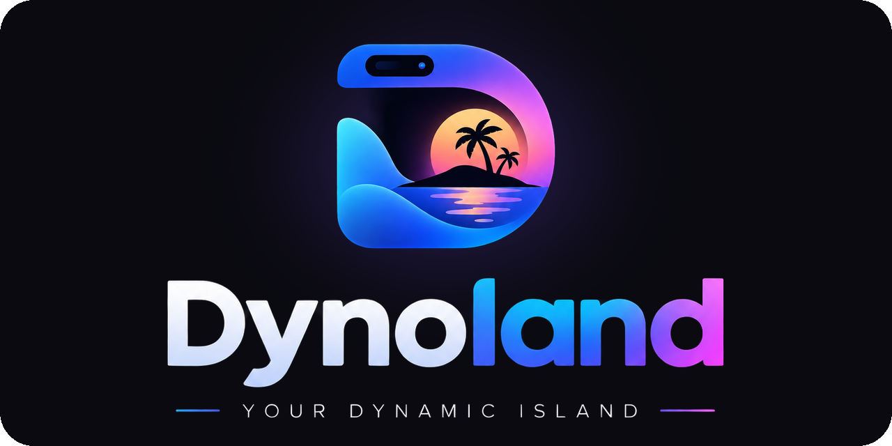
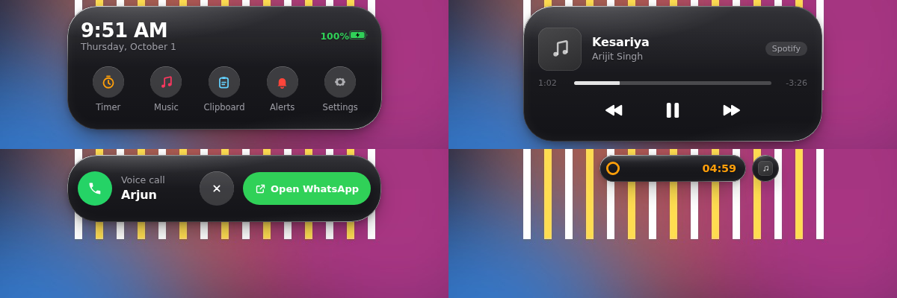

<p align="center"></p>

# Dynoland

Dynoland is a dynamic island for Windows, built with Electron, React and Motion. A small glass semicircle sits at the top of your screen; it shows what's playing, your notifications and calls, timers and more, and morphs between shapes with spring animations.



## Run it

Two ready-made builds are produced in `release/`:

- **Dynoland-Setup-1.4.0.exe** installs the app with Start menu and desktop shortcuts, supports "Start with Windows", and updates itself. Recommended. Running it over an older version upgrades it and keeps your settings.
- **Dynoland-Portable-1.4.0.exe** runs without installing. It starts a little slower and doesn't update itself.

The builds are not code-signed, so Windows SmartScreen will warn the first time. Click **More info → Run anyway**.

Once running, a small semicircle hangs from the top-center of your main display and Dynoland sits in the system tray. Press **Ctrl+Shift+D** (or click the tray icon) to open the control panel.

## Using the island

| Action | Result |
|---|---|
| Hover the idle semicircle | Opens into a notch with the time and battery |
| Click it while idle | Opens the feature menu: timer, music, clipboard, alerts, phone, settings |
| Right-click it any time | Opens the feature menu, even while something is running |
| Click a running activity | Expands it |
| Move the pointer away | Collapses it after a moment |
| Click a notification | Opens the app it came from |
| Hover an alert | Pauses its auto-dismiss |
| Click the small circle beside the island | Switches to the other running activity |
| Scroll over the island | Cycles through running activities |

## Liquid glass

The island is drawn as liquid glass by default: what's behind it is blurred, saturated and slightly magnified, the edges bend it a little more, and a bright rim catches the light. Switch to **Black** in Appearance if you prefer the classic look.

Windows doesn't let an app see through its own window, so the glass needs a picture of what's behind it. **Glass shows** has two choices:

- **Apps behind it** (default): a small helper (`native/GlassCapture.cs`, compiled by the PowerShell built into Windows) finds the windows under the island, skips the island itself, and captures just that strip. It notices when you switch, open, move or close a window within about a tenth of a second and refreshes right away, then fades the new background in; otherwise it refreshes every 0.7 to 2 seconds depending on how big the island is. It's layered over the wallpaper, so a partly covered area looks right too. The island still appears in screenshots and recordings.
- **Wallpaper**: only the wallpaper, with no capturing at all, for the lowest power use.

With glass, the **Tint** setting (100/90/80%) controls how dark the glass is; it never makes the island see-through. With Black, the same setting is plain opacity.

Known limits: scrolling inside the same app isn't detected instantly, so the glass catches up within a second or so. Apps running as administrator and some video players can't be captured; behind those the glass shows the wallpaper or a dark fill.

## Connected apps

**Music and media.** The island shows what's playing in any app that appears in the Windows volume flyout: Spotify, YouTube or YouTube Music in a browser, Apple Music, Media Player and others, with artwork and working play, pause, next and previous. A small built-in PowerShell script (`native/media.ps1`) reads the Windows media session API; no extra software is needed.

**Notifications and calls.** The island mirrors notifications from WhatsApp, Telegram, Teams, Outlook and any other app, by reading the notification history Windows keeps for your account. Incoming calls (for example a WhatsApp voice or video call) show the caller with an **Open** button that brings the app to the front. Answering and declining still happen in the app itself, because Windows doesn't let one app press another app's buttons. You can turn individual apps off, hide message text, or turn calls off in **Connected apps**.

For an app to appear, it has to be allowed to show notifications in Windows Settings → System → Notifications.

**Your phone.** Windows can't read a phone's notifications over Bluetooth by itself, so Dynoland uses Microsoft Phone Link (included with Windows 11) for the connection. Phone Link pairs with Android (through the Link to Windows app) or iPhone over Bluetooth and turns the phone's messages, notifications and calls into Windows notifications; Dynoland shows them with the original app, the sender's photo and a phone badge. The **Phone** section of the control panel walks through the setup with buttons for Bluetooth settings and Phone Link. Calls show the caller with an **Open Phone Link** button; answering happens in Phone Link.

**Real:** media, notifications and calls (from this PC and your phone), copied text, charging and low battery, and the timer. **Demo only** (Try it section): the demo music player, downloads, and the phone call.

## Updates

Installed copies check [github.com/Kailash2006/dynamic-island-desktop](https://github.com/Kailash2006/dynamic-island-desktop/releases) on startup and every six hours, download new versions in the background, and show **Update ready** on the island. Clicking it restarts into the new version. You can also check from **System → Check for updates**.

### Publishing a new version

Releases are built on GitHub by `.github/workflows/release.yml`, so nothing large ever has to be uploaded:

1. Raise `version` in `package.json` (for example 1.2.2 → 1.2.3).
2. Zip the project without `node_modules`, `dist`, `release` and `.github`, name it `source.zip`, and upload it to the repository root (**Add file → Upload files**).
3. The Release workflow replaces the repository's files with the zip's contents (so deleted files disappear too), builds the installer on a Windows machine, and publishes release `v1.2.3` with the installer, `latest.yml` and the blockmap.

If the version in `package.json` already has a release, the workflow skips publishing. You can also start it from **Actions → Release → Run workflow**.

Versions 1.0.0 to 1.2.0 (then called Dynamic Island) can't update themselves, so install 1.2.1 or later once by hand. From then on updates are automatic. The portable version never updates itself.

## Develop

Requires Node.js 20 or newer.

```bash
npm install
npm run dev          # Vite dev server + Electron with hot reload
npm run snapshot     # renders every island state to PNGs in snapshots/
```

## Build the .exe

```bash
npm run build            # installer + portable exe → release/
npm run build:installer  # installer only
npm run build:portable   # portable only
```

Run these on Windows. (Building Windows targets from Linux or macOS also works but needs Wine.)

## Project structure

```
electron/
  main.cjs          overlay window, click-through, tray, settings, control panel
  preload.cjs       the only bridge between Electron and React
  updater.cjs       automatic updates from GitHub Releases
  integrations/
    media.cjs         runs native/media.ps1 for now-playing info and controls
    notifications.cjs reads new toasts (messages, calls) from Windows' notification history
    backdrop.cjs      what the liquid glass refracts (apps behind it, or the wallpaper)
  assets/           tray icons
native/
  media.ps1         Windows media session helper (PowerShell 5.1, built into Windows)
  glass.ps1         starts the glass helper
  GlassCapture.cs   captures the app windows behind the island for the glass
src/
  components/
    DynamicIsland/      the island: sizing, spring morph, idle bounce, liquid glass
    HomeActivity/       the feature menu shown when you click the idle island
    MediaActivity/  AppCallActivity/
    ActivitySwitcher/   the split-off circle for a second activity
    MusicActivity/  TimerActivity/  ChargingActivity/  DownloadActivity/
    CallActivity/   NotificationActivity/ ClipboardActivity/
    StatusActivity/ IdleActivity/
    ControlPanel/       demo buttons and settings (Ctrl+Shift+D)
    registry.js         sizes and views for every activity type
  services/
    activityManager.js  the store: show, update, remove, focus, expire
    activities/         controllers that feed activities (timer, battery, media…)
    commands.js         routes control-panel buttons to controllers
  hooks/  utils/  styles/
build/              app icons used by electron-builder
scripts/snapshot.cjs  dev-only: `npm run snapshot` renders every state to PNGs in snapshots/
```

### How the window works

The overlay is a single fixed-size, transparent, always-on-top window. It never resizes; only the pill inside animates, which keeps the motion smooth. The window ignores the mouse everywhere except over the pill, so the transparent area never blocks the apps underneath.

### Adding an activity

1. Show it from anywhere in the renderer:

   ```js
   import { island } from './services/activityManager.js';

   island.show({ type: 'download', fileName: 'data.csv', totalMB: 20, receivedMB: 0, speed: 0 });
   island.update('download', { receivedMB: 12 });
   island.remove('download');

   // Alerts disappear on their own:
   island.show({ type: 'status', kind: 'alert', variant: 'success', title: 'Saved', duration: 3000 });
   ```

2. For a new type, create its component folder and register its sizes and views (`Compact`, `Expanded`, `Banner`, `Minimal`) in `src/components/registry.js`.

## Next steps

- Real browser downloads through a small browser extension.
- An AI prompt mode that makes the island focusable while it is open.
- Code-signing the installer so SmartScreen stops warning.

## License

MIT
